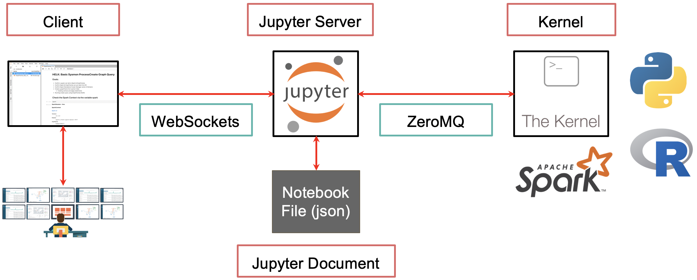
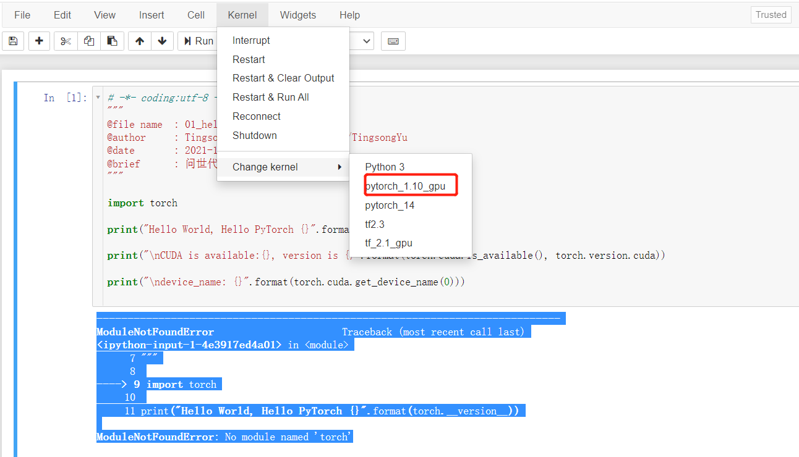
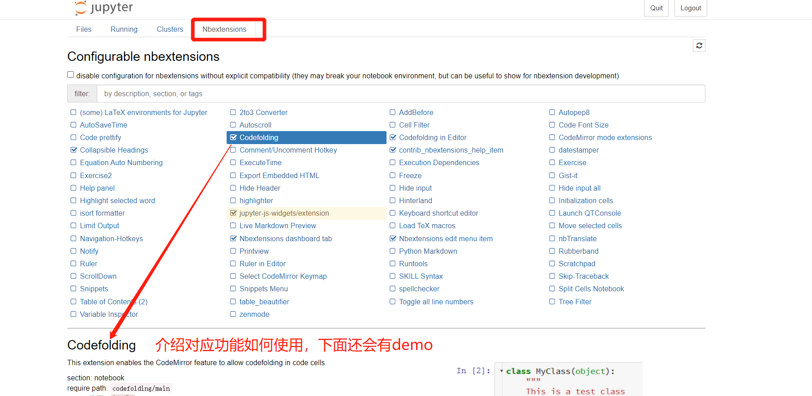
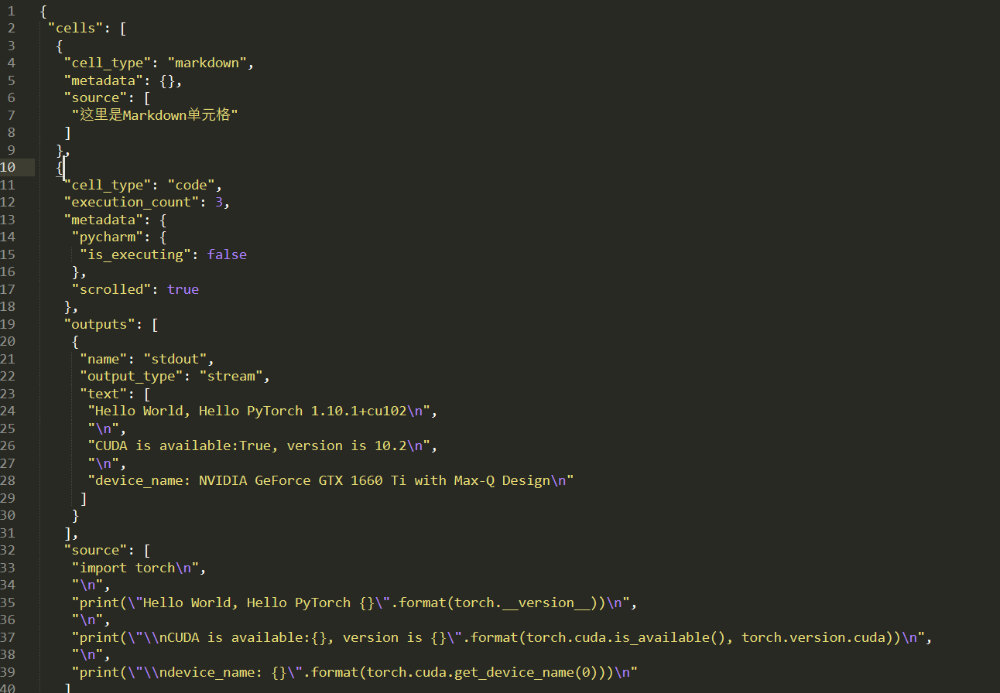
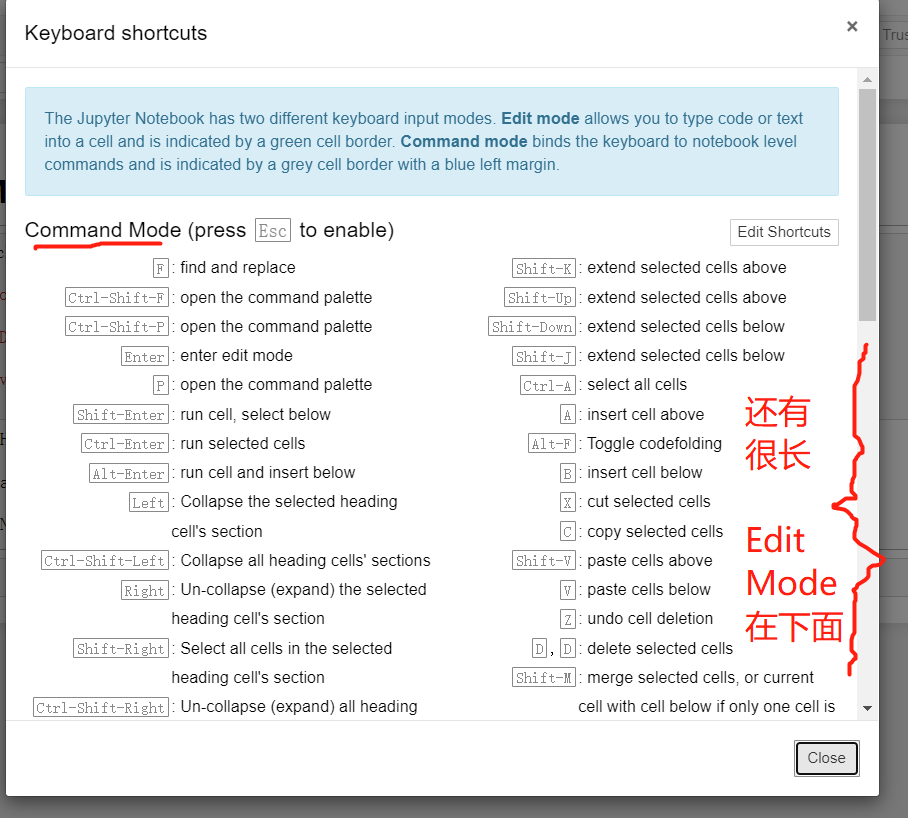
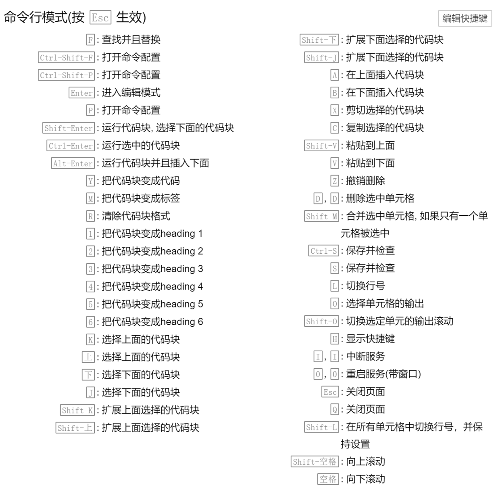
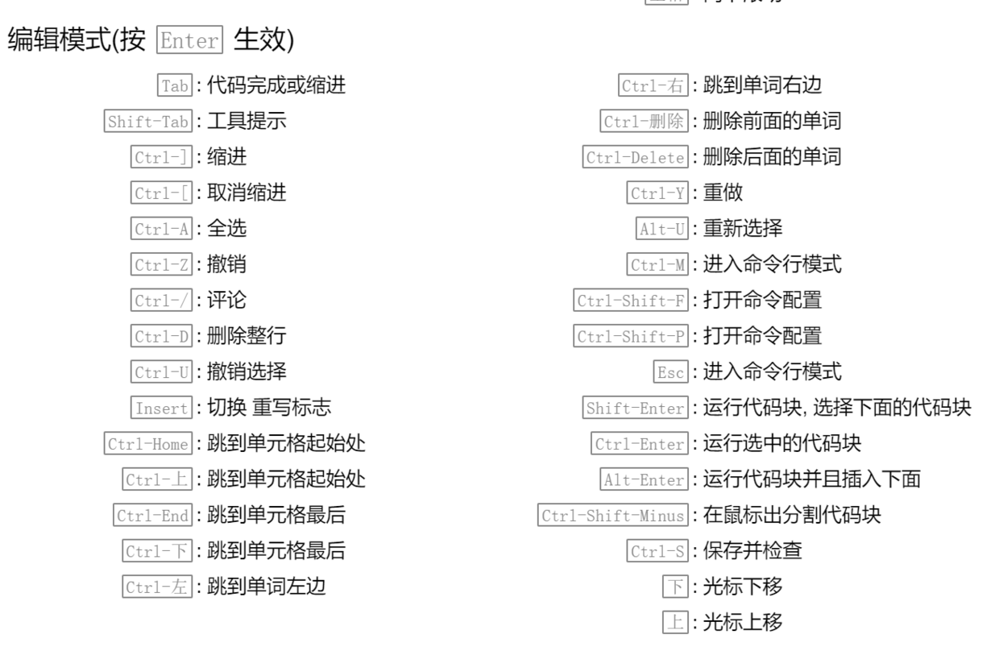

# 1.6 环境配置之Jupyter Notebook

## 什么是 jupyter notebook

经过前几个小节，大家已经具备了PyTorch开发环境，但本教程需要照顾初学者使用代码，让刚入门的同学有更好的代码学习体验。因此，在上篇，主要采用Jupyter Notebook进行代码演示。

**注意**："Notebook只建议用于学习目的，不建议用于项目开发" *** 3**， 重要事说三遍！

为什么？这是由于notebook自身定位决定的，先来看看jupyter notebook 的定义“The Jupyter Notebook is a web application for creating and sharing documents that contain code, visualizations, and text. It can be used for data science, statistical modeling, machine learning, and much more.”——[官网](https://jupyter.org/)

Jupyter  notebook 是一个网页应用，在这个网页上可以编写代码、做可视化、写文本，这就是非常好的教学展示平台。可以在上面进行概念描述、配上代码、运行结果，并且可以按小段进行代码运行，给用户更多的交互体验，便于用户理解代码细节。

基于此，上篇主要采用notebook进行代码讲解，到了中篇，基于完整的项目代码框架进行应用开发。

关于jupyter与jupyter notebook的关系，请大家查看[官网](https://jupyter.org/)（以下开始，notebook 指代 jupyter notebook）

## notebook 运行逻辑

notebook不是一个简单的web应用程序，它还需要关联指定的kernel，用于执行我们的代码。相信刚接触notebook的朋友大多都被notebook, kernel的概念搞的一头雾水。如果上述概念理不清楚，就更不清楚如何配置kernel，选择指定的虚拟环境了。

下面，我们先来看看notebook的结构



<center style="font-size:14px;color:#C0C0C0;text-decoration:underline">图片来自官网</center>

图中左边是用户写的代码，传输到中间的Jupyter server, server本身不能执行代码（python.exe干的活，server是不会的），server把代码传给Kernel，Kernel才是真正干活，执行代码的地方。Kernel执行完代码，把结果返回给server，再返回到用户的网页。

从图中可以看出Kernel不仅可以是python.exe，也可以是其他语言的解释器，如Julia, R等，更多kernel可以看[支持的kernel列表](https://github.com/jupyter/jupyter/wiki/Jupyter-kernels).

通过上述示意图我们就知道了，在pytorch开发中，kernel其实就是某一个python解释器——python.exe，我们需要让当前的notebook启用对应的kernel，来进入相应的虚拟环境，这样才能运行代码。

## notebook 安装

理清概念，下面进行notebook安装，我们续期是正确调用pytorch_1.10_gpu这个虚拟环境来执行notebook上的代码。

 安装过程分3步：

1. 进入虚拟环境：conda activate pytorch_1.10_gpu

2. 安装ipykernel工具包（安装jupyter）: pip install jupyter

3. 添加kernel到notebook： python -m ipykernel install --user --name pytorch_1.10_gpu

   (意思是，将python这个kernel添加到jupyter的kernel中，由于当前已经在虚拟环境中，所以第一个python表示的含义是：D:\Anaconda_data\envs\pytorch_1.10_gpu\python.exe；而pytorch_1.10_gpu是kernel的别名，用于区分不同的kernel，这里建议与虚拟环境名称保持一致就好)

   

### **启动**

在命令窗中执行jupyter notebook就可以打开web应用了，网址为:http://localhost:8888; 这里默认端口为8888，如果你再次启动一个jupyter notebook，可以看到端口号变为了8889，即它是另外一个web服务。

进入之后，我们可以看到有一个/目录，我们需要找到我们的notebook文件进行打开，这里有一个小技巧，就是进入到指定文件夹后，再运行notebook，这样notebook的路径就进入了想要的文件夹。


### 配置kernel

我们进入 chapter-1/02-notebook-demo.ipynb，点击run，可发现如下报错

> ```
> ---------------------------------------------------------------------------
> ModuleNotFoundError                       Traceback (most recent call last)
> <ipython-input-1-4e3917ed4a01> in <module>
>       7 """
>       8 
> ----> 9 import torch
>      10 
>      11 print("Hello World, Hello PyTorch {}".format(torch.__version__))
> 
> ModuleNotFoundError: No module named 'torch'
> ```

告诉我们找不到torch这个包，这很明显，使用的kernel不是我们的D:\Anaconda_data\envs\pytorch_1.10_gpu\python.exe。

下面我们来设置一下，方法很简单：



再次运行，可看到以下信息，表明notebook的环境就配置好了。

>```
>Hello World, Hello PyTorch 1.10.1+cu102
>
>CUDA is available:True, version is 10.2
>
>device_name: NVIDIA GeForce GTX 1660 Ti with Max-Q Design
>```


实用插件——jupyter_contrib_nbextensions

原生的notebook还是缺点意思，这里推荐大家安装jupyter_contrib_nbextensions插件，[jupyter_contrib_nbextensions](https://github.com/DandanW924/jupyter_contrib_nbextensions)提供了非常丰富的功能，例如代码折叠、分段折叠、代码自动补全、字体大小、行号显示、目录索引等等，详见下图



 插件安装十分简单，打开命令窗，进入**虚拟环境**，分别依次执行 :

> pip install jupyter_contrib_nbextensions
> jupyter contrib nbextension install --user

然后重启notebook，就可以看到导航栏里有**Nbextensions**，大家可以根据自己的喜好进行调整，更多内容请查看[Github](https://github.com/ipython-contrib/jupyter_contrib_nbextensions)

## Notebook 快速上手

notebook所使用的文件格式为.ipynb，jupyter会将.ipynb转为json进行保存，这样便于版本记录以及分享。

例如下图是用sublime打开的 02-notebook-demo.ipynb




下面，我们来研究notebook界面和常用的操作。

界面中需要认识的几个模块分别是：菜单栏、工具栏、单元格（cell）

**菜单栏**：用得最多的是Kernel，用于中断程序、重启解释器环境、切换解释器等；其它按键顾名思义。

**工具栏**：一些功能的按钮，高手都是用快捷键的。

**单元格**：这就是承载信息的地方，cell可分为code cells, markdown cells, raw cells。用得最多的是code cells和markdown cells。

右上角有一个小圆圈，用于观察当前kernel运行状态，如果是实心的，表明kernel正在运行某个cell，被运行的cell以及等待运行的cell的左边会有一个*****


notebook 的两种模式

Notebook中的单元，有两种模式：命令模式(Command Mode)与编辑模式(Edit Mode)，在不同模式下我们可以进行不同的操作。

命令模式：cell的边框为蓝色，此时可对cell进行操作。在编辑模式下，按`esc`键进入命令模式。

编辑模式：cell的边框为绿色，此时可在单元格内编辑代码或文档。在命令模式下，按`enter`或`return`键进入编辑模式。

常用快捷键

在命令模式下，按下“h”键，就会弹出快捷键的介绍，但是太多了，不方便初学者使用，这里总结一些常用的，实用的快捷键供大家参考。




**命令模式：**

插入单元格： A 键上方插入，B 键在下方插入

合并单元格：选中多个单元格，Shift + M

显示行号：L

删除单元格：连续按两次D

剪切单元格：X。 通常我用X代替删除，毕竟只用按一个键，哈哈。

复制粘贴单元格： C/V

撤销删除的单元格：要撤消已删除的单元格，请按 Z 键

**编辑模式：**

**运行单元格**：Ctrl + Enter 

**运行并创建新单元格**：Alt + Enter 

分割单元格：光标放到想要分割的地方，Ctrl + Shift + - 

函数详情：Shift+Tab （注意，要把模块导入才会提示函数详情！）


请大家将以上快捷键都试用一遍，这些是高频快捷键，下面给大家列举所有快捷键，请收藏。






下面再介绍两个神奇操作，分别是在单元格中执行shell命令以及magic操作。

请自行尝试!+shell命令进行体会。

**magic commands**

Magic关键字是 IPython 的高级用法，如%matplotlib将matplolib设置为交互式

%和%%分别代表 **行Magic命令** 和 **单元格Magic命令**

演示一个魔法命令 %%timeit

```
%%timeit
a = []
for i in range(10):
    a.append(i)
```

> ```
> 858 ns ± 50.3 ns per loop (mean ± std. dev. of 7 runs, 1000000 loops each)
> ```

表示将代码段运行了100万次，并统计运行时间。

更多更全的magic commands请看这里[Jupyter 魔术命令（magic commands）](https://www.cnblogs.com/bind/p/11958317.html)

更多奇淫技巧推荐大家看看[Jupyter Notebook 有哪些奇技淫巧？](https://www.zhihu.com/question/266988943)

更多官方信息请查看[Jupyter Notebook docs](https://jupyter-notebook.readthedocs.io/en/stable/index.html)